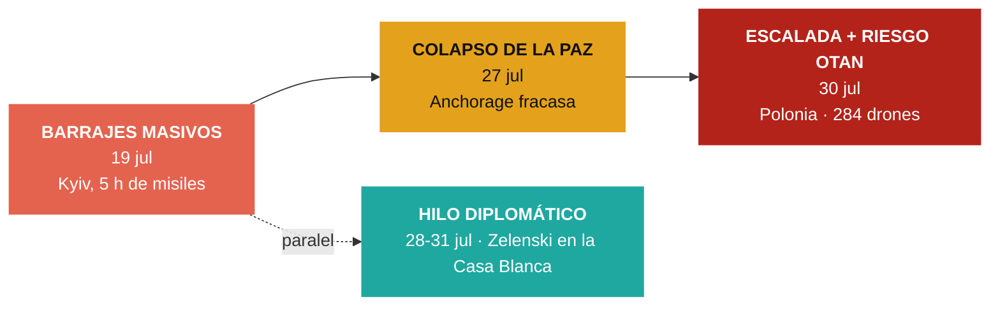

# Cuadro de tendencias — Conflicto Rusia vs. Ucrania

> [!info] Basado en **9 nodos de impacto** genuinos verificados por Global Pulse entre el **19 de julio** y el **3 de agosto de 2026**. Cobertura más discontinua que la de Irán–EE.UU.: el conflicto aparece como **guerra de fondo** (más de 4 años) con **picos** de bombardeo y un hilo diplomático en Washington.

## 1. Arco del periodo (3 líneas de tendencia)



## 2. Tabla cronológica de hitos

| Fecha | Impacto | K | Hito clave |
|---|---|---|---|
| 19 jul | 83 | K0 | Rusia machaca **Kyiv durante 5 horas**: uno de sus mayores ataques balísticos, ≥1 muerto |
| 19 jul | 78 | K1 | **~40 misiles Iskander-M/Zircon + 125 drones** sobre Kyiv y otras ciudades |
| 19 jul | 72 | K1 | Escalada mutua: Ucrania golpea **centros logísticos rusos** de suministro |
| 27 jul | 78 | K0 | **La paz colapsa**: EE.UU. y Rusia dan por fracasados los acuerdos de **Anchorage**; ≥30 muertos en 2 días |
| 28 jul | 78 | K1 | Trump recibe a **Zelenski** y Netanyahu por separado en la Casa Blanca |
| 29 jul | 95 | K1 | Visitas oficiales de Netanyahu y Zelenski a Washington |
| 30 jul | 78 | K2 | **Ataque ruso récord: 74 misiles + 284 drones**, ≥13 muertos (niños incluidos); **Polonia** investiga una violación de su espacio aéreo |
| 31 jul | 95 | K1 | Zelenski pasa **"de apestado a héroe"**: Trump lo recibe con sonrisas |
| 3 ago | 61 | K0 | Dron ucraniano incendia un almacén de **Wildberries** (el "Amazon ruso") en la región de Vladímir |

## 3. Indicadores cuantitativos (tendencia)

| Indicador | 19 jul | → | 30 jul |
|---|---|---|---|
| Misiles por oleada | ~40 | ▲ | **74** |
| Drones por oleada | 125 | ▲▲ | **284** |
| Muertos por ataque | ~1 | ▲ | **≥13** |
| Alcance de Ucrania | Logística fronteriza | ▲ | Interior profundo (Vladímir) |

## 4. Sub-tendencias detectadas

- **Escalada en la escala del ataque:** el volumen por oleada casi se **duplica en misiles** (40→74) y se **duplica en drones** (125→284) en once días. La tendencia dominante es cuantitativa, no territorial.
- **Colapso de la vía diplomática de fondo:** los **acuerdos de Anchorage** entre EE.UU. y Rusia se declaran fracasados (27 jul), lo que reinicia el proceso desde cero y coincide con el repunte de bombardeos.
- **Riesgo de desbordamiento a la OTAN:** por primera vez en el periodo, **Polonia** hace despegar cazas e investiga una violación de su espacio aéreo (30 jul) — el conflicto roza el territorio aliado.
- **Golpes ucranianos en profundidad:** Ucrania deja de limitar sus ataques a la logística fronteriza y alcanza infraestructura civil-económica en el **interior ruso** (Vladímir, 3 ago).
- **Realineamiento con Washington:** el estatus de Zelenski ante Trump mejora visiblemente ("de apestado a héroe", recibido "con sonrisas" mientras Netanyahu recibe "advertencias"), un giro relacional a seguir.

## 5. Estado al 3 de agosto

> [!warning] **Guerra activa y sin canal de paz.** Con Anchorage fracasado y sin un nuevo marco, la tendencia es de **intensificación de barrages** y golpes ucranianos cada vez más profundos, con el añadido peligroso del **roce con la OTAN** (Polonia). El foco diplomático de EE.UU. está absorbido por Oriente Medio (Irán/Gaza), dejando el frente ucraniano sin mediación activa.

> [!note] Nota de cobertura
> El sistema registró menos nodos de este conflicto que del de Irán–EE.UU. en el mismo periodo (la agenda informativa estuvo dominada por Oriente Medio). Este cuadro refleja los picos capturados, no una cobertura continua día a día.

## 6. Últimos nodos relacionados — actualización automática

> [!tip] Esta tabla se **rellena sola** con los nodos más recientes del tema cada vez que Obsidian sincroniza (requiere el plugin **Dataview**). El análisis de arriba es una foto fija con fecha; esta lista es la **señal viva** de material nuevo. Filtra por palabra clave en el nombre del nodo, así que puede incluir algún ítem tangencial.

```dataview
TABLE fecha AS "Fecha", impacto AS "Impacto", categoria AS "Categoría", kardashev AS "K"
FROM "10 · Nodos"
WHERE contains(lower(file.name), "ucrania") OR contains(lower(file.name), "ukrain") OR contains(lower(file.name), "rusia") OR contains(lower(file.name), "russia") OR contains(lower(file.name), "kyiv") OR contains(lower(file.name), "zelensk")
SORT fecha DESC, impacto DESC
LIMIT 25
```

---
### Nodos fuente (Capa 3)
Ver `10 · Nodos/Geopolitica/` — notas del 2026-07-19 al 2026-08-03 sobre Rusia/Ucrania. Fuentes: The Guardian, DW, France 24, El País, RFI, Reuters, entre otras.

[[Global Brain — Inicio|← Inicio]] · [[Tendencias — Conflicto Iran vs EEUU|Ver conflicto Irán–EE.UU.]]
