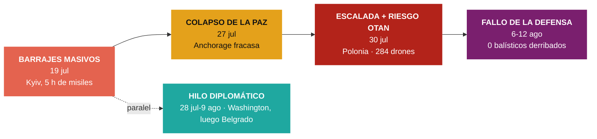

# Cuadro de tendencias — Conflicto Rusia vs. Ucrania

> [!info] Basado en **17 nodos de impacto** genuinos verificados por Global Pulse entre el **19 de julio** y el **12 de agosto de 2026**. Cobertura más discontinua que la de Irán–EE.UU.: el conflicto aparece como **guerra de fondo** (más de 4 años) con **picos** de bombardeo y un hilo diplomático en Washington.
>
> **Actualizado el 12 de agosto**: la ventana anterior cerraba el 3 de agosto. Lo añadido cambia el eje del análisis — de «cuántos misiles caen» a **cuántos se consiguen derribar**, que es donde se está decidiendo.

## 1. Arco del periodo (3 líneas de tendencia)



## 2. Tabla cronológica de hitos

| Fecha | Impacto | K | Hito clave |
|---|---|---|---|
| 19 jul | 83 | K0 | Rusia machaca **Kyiv durante 5 horas**: uno de sus mayores ataques balísticos, ≥1 muerto |
| 19 jul | 78 | K1 | **~40 misiles Iskander-M/Zircon + 125 drones** sobre Kyiv y otras ciudades |
| 19 jul | 72 | K1 | Escalada mutua: Ucrania golpea **centros logísticos rusos** de suministro |
| 27 jul | 78 | K0 | **La paz colapsa**: EE.UU. y Rusia dan por fracasados los acuerdos de **Anchorage**; ≥30 muertos en 2 días |
| 28 jul | 78 | K1 | Trump recibe a **Zelenski** y Netanyahu por separado en la Casa Blanca |
| 29 jul | 95 | K1 | Visitas oficiales de Netanyahu y Zelenski a Washington |
| 30 jul | 78 | K2 | **Ataque ruso récord: 74 misiles + 284 drones**, ≥13 muertos (niños incluidos); **Polonia** investiga una violación de su espacio aéreo |
| 31 jul | 95 | K1 | Zelenski pasa **"de apestado a héroe"**: Trump lo recibe con sonrisas |
| 3 ago | 61 | K0 | Dron ucraniano incendia un almacén de **Wildberries** (el "Amazon ruso") en la región de Vladímir |
| 6 ago | 83 | K1 | **Ucrania no derriba ni un solo misil balístico** en el ataque del miércoles; la OTAN promete defensa aérea "urgente" y Zelenski alerta del **aumento de la producción rusa de misiles** |
| 6 ago | 78 | K0 | Bombardeo sobre Kiev: **≥21 muertos**, almacenes como objetivo; la UE responde con **1.400 millones** de ayuda |
| 6 ago | 83 | K1 | **Dron con explosivos en el aeropuerto de Leipzig**: el ministro del Interior alemán habla de "nuevo nivel de peligro" y de "escenario de amenaza híbrida profesional" |
| 7 ago | 75 | K1 | Ucrania golpea **refinerías a más de 1.300 km** dentro de Rusia para cortar los ingresos de la guerra; ≥17 muertos en Kyiv el mismo día |
| 9 ago | 74 | K1 | **Zelenski visita Serbia** por primera vez: Belgrado mantiene lazos con Moscú y **se niega a sancionar a Rusia** |
| 12 ago | 83 | K1 | Intercambio de golpes: Rusia sobre Kyiv, Zaporiyia y Dnipropetrovsk; Ucrania con drones sobre **Vorónezh** — y otro almacén de Wildberries ardiendo |

## 3. Indicadores cuantitativos (tendencia)

| Indicador | 19 jul | → | 30 jul |
|---|---|---|---|
| Misiles por oleada | ~40 | ▲ | **74** |
| Drones por oleada | 125 | ▲▲ | **284** |
| Muertos por ataque | ~1 | ▲ | **≥13** |
| Alcance de Ucrania | Logística fronteriza | ▲▲ | **1.300 km** dentro de Rusia (refinerías, 7 ago) |
| Intercepción ucraniana | parcial | ▼▼ | **0 balísticos derribados** en una oleada (6 ago) |
| Producción rusa de misiles | — | ▲ | en aumento, según Zelenski (6 ago) |
| Roce con la OTAN | espacio aéreo polaco (30 jul) | ▲ | **bomba en un aeropuerto alemán** (6 ago) |

## 4. Sub-tendencias detectadas

- **Escalada en la escala del ataque:** el volumen por oleada casi se **duplica en misiles** (40→74) y se **duplica en drones** (125→284) en once días. La tendencia dominante es cuantitativa, no territorial.
- **Colapso de la vía diplomática de fondo:** los **acuerdos de Anchorage** entre EE.UU. y Rusia se declaran fracasados (27 jul), lo que reinicia el proceso desde cero y coincide con el repunte de bombardeos.
- **Riesgo de desbordamiento a la OTAN:** por primera vez en el periodo, **Polonia** hace despegar cazas e investiga una violación de su espacio aéreo (30 jul) — el conflicto roza el territorio aliado.
- **Golpes ucranianos en profundidad:** Ucrania deja de limitar sus ataques a la logística fronteriza y alcanza infraestructura civil-económica en el **interior ruso** (Vladímir, 3 ago).
- **Realineamiento con Washington:** el estatus de Zelenski ante Trump mejora visiblemente ("de apestado a héroe", recibido "con sonrisas" mientras Netanyahu recibe "advertencias"), un giro relacional a seguir.
- **NUEVO · El dato que reordena el cuadro: cero intercepciones.** Hasta ahora la métrica era cuántos misiles lanzaba Rusia. El 6 de agosto aparece la que importa de verdad: Ucrania **no derribó ni un solo misil balístico** de una oleada entera. Junto al aviso de Zelenski sobre el **aumento de la producción rusa**, dibuja una carrera de desgaste que Ucrania está perdiendo por el lado del interceptor, no del lanzador. La respuesta —Patriot "urgentes" de la OTAN, 1.400 millones de la UE— llega en forma de suministro y dinero, no de capacidad instalada.
- **NUEVO · Guerra económica en profundidad, y repetida.** Ucrania pasa de la logística fronteriza a **refinerías a 1.300 km** con un objetivo declarado: cortar los ingresos que pagan la guerra. Y el almacén de Wildberries que ardió el 3 de agosto vuelve a arder el 12. No es una incursión simbólica: es una campaña sostenida contra la economía civil rusa.
- **NUEVO · La amenaza híbrida entra en territorio OTAN.** El 30 de julio fue un objeto en el espacio aéreo polaco; el 6 de agosto, un **dron con explosivos en el aeropuerto de Leipzig**, que Alemania trata como "escenario de amenaza híbrida profesional". La diferencia importa: lo primero pudo ser un desvío, lo segundo es una operación. El desbordamiento ya no es un riesgo teórico y llega en formato deniable.
- **NUEVO · Diplomacia de márgenes.** Con Anchorage muerto y Washington absorbido por Oriente Medio, Zelenski busca apoyos donde son más difíciles: **Serbia**, que mantiene lazos con Moscú y se niega a sancionar. Es la medida de cuánto se ha estrechado su margen — cuando se corteja a los no alineados, es que los alineados ya dieron lo que tenían.

## 5. Estado al 12 de agosto

> [!warning] **Guerra de desgaste que Ucrania pierde en el aire y compensa en profundidad.** Sin canal diplomático desde el fracaso de Anchorage, el conflicto se ha convertido en dos campañas paralelas: Rusia aumenta producción y volumen de misiles contra unas defensas que el 6 de agosto no interceptaron **ninguno**; Ucrania renuncia a disputar el aire y golpea la **economía** rusa a 1.300 km. Mientras tanto, la amenaza híbrida cruza a territorio OTAN en formato deniable.
>
> **Los tres indicadores a vigilar:** (1) si los Patriot prometidos por la OTAN llegan y la tasa de intercepción se recupera, que es el indicador de supervivencia; (2) si los incidentes tipo Leipzig se repiten, porque marcarían una campaña y no un episodio; (3) si Washington reabre algún canal, hoy inexistente y absorbido por Oriente Medio.

> [!note] Lo que cambió respecto al cierre del 3 de agosto
> Aquel cuadro medía la escalada por el tamaño de las oleadas (40→74 misiles, 125→284 drones). Esa métrica ha quedado incompleta: importa más **cuántos se paran**. El 6 de agosto se paró ninguno.

> [!note] Nota de cobertura
> El sistema registró menos nodos de este conflicto que del de Irán–EE.UU. en el mismo periodo (la agenda informativa estuvo dominada por Oriente Medio). Este cuadro refleja los picos capturados, no una cobertura continua día a día.

## 6. Últimos nodos relacionados — actualización automática

> [!tip] Esta tabla se **rellena sola** con los nodos más recientes del tema cada vez que Obsidian sincroniza (requiere el plugin **Dataview**). El análisis de arriba es una foto fija con fecha; esta lista es la **señal viva** de material nuevo. Filtra por palabra clave en el nombre del nodo, así que puede incluir algún ítem tangencial.

```dataview
TABLE fecha AS "Fecha", impacto AS "Impacto", categoria AS "Categoría", kardashev AS "K"
FROM "10 · Nodos"
WHERE contains(lower(file.name), "ucrania") OR contains(lower(file.name), "ukrain") OR contains(lower(file.name), "rusia") OR contains(lower(file.name), "russia") OR contains(lower(file.name), "kyiv") OR contains(lower(file.name), "zelensk")
SORT fecha DESC, impacto DESC
LIMIT 25
```

---
### Nodos fuente (Capa 3)
Ver `10 · Nodos/Geopolitica/` — notas del 2026-07-19 al 2026-08-12 sobre Rusia/Ucrania. Fuentes: The Guardian, DW, France 24, El País, RFI, Reuters, entre otras.

[[Global Brain — Inicio|← Inicio]] · [[Tendencias — Conflicto Iran vs EEUU]] · [[Tendencias — Gaza y Oriente Medio]] · [[Tendencias — Gobernanza y riesgo de la IA]]
