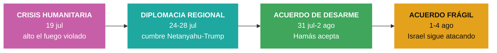

# Cuadro de tendencias — Gaza y Oriente Medio

> [!info] Basado en **11 nodos de impacto** con foco en el Levante (Israel-Hamás, Gaza, diplomacia regional), verificados por Global Pulse entre el **19 de julio** y el **4 de agosto de 2026**. Hilo **entrelazado** con el conflicto Irán–EE.UU. pero con dinámica propia: crisis humanitaria → arquitectura diplomática → acuerdo de desarme frágil.

## 1. Arco del periodo (4 fases)

## 2. Tabla cronológica de hitos

| Fecha | Impacto | K | Hito clave |
|---|---|---|---|
| 19 jul | 95 | K1 | Israel mantendrá tropas en **"zonas de seguridad"** en Líbano, Siria y Gaza |
| 19 jul | 82 | K0 | **Epidemia de varicela** en Gaza: 9.300 casos en 2 semanas entre 1,7 M de desplazados |
| 19 jul | 78 | K1 | Crisis humanitaria pese al alto el fuego; ataque israelí a un funeral deja 7 muertos |
| 24 jul | 95 | K1 | Trump condiciona la cooperación nuclear con **Arabia Saudita** a los **Acuerdos de Abraham** |
| 28 jul | 95 | K2 | Cumbre **Netanyahu-Trump**: la **Fuerza Internacional en Gaza** en el centro de la agenda |
| 28 jul | 69 | K1 | **Francia** asume "papel líder" como mediador; ayuda humanitaria vía Egipto |
| 31 jul | 78 | K1 | Trump anuncia acuerdo para el **desarme total de Hamás** ("Junta de Paz", negociado en El Cairo) |
| 1 ago | 95 | K1 | Israel **ataca la mezquita Al Muttaquin** en Gaza mientras Hamás llega a Egipto |
| 2 ago | 95 | K1 | Israel guarda **silencio** sobre el acuerdo anunciado por Trump y aprobado por Hamás |
| 3 ago | 77 | K1 | Arabia Saudita anuncia **coalición de ~14 países** para asegurar el **Mar Rojo** (Bab al Mandeb) |
| 4 ago | 78 | K2 | Israel **intensifica ataques** en Gaza pese al desarme; crecen tensiones con la "Junta de Paz" |

## 3. Indicadores y ejes de tendencia

| Eje | Estado inicial (19 jul) | Evolución | Estado al 4 ago |
|---|---|---|---|
| Situación humanitaria | Epidemia + 1,7 M desplazados; alto el fuego violado | ▬ persistente | Ataques matan a decenas pese al "acuerdo" |
| Vía diplomática | Sin marco | ▲ cumbre + Junta de Paz + Fuerza Internacional | Acuerdo anunciado, **no consolidado** |
| Postura de Israel | Tropas en zonas de seguridad (Líbano/Siria/Gaza) | ▬ inflexible | Sigue bombardeando; choca con Trump |
| Actores mediadores | — | ▲ EE.UU., Egipto, Francia, Arabia Saudita | Arquitectura multi-actor |
| Dimensión marítima | — | ▲ amenaza hutí en el Mar Rojo | Coalición saudí de 14 países |

## 4. Sub-tendencias detectadas

- **La brecha "acuerdo anunciado" vs. "realidad sobre el terreno":** Trump proclama el desarme de Hamás (vía Truth Social), pero **Israel mantiene silencio, ataca una mezquita e intensifica los bombardeos** en los días siguientes. La tendencia clave del cierre es el **desajuste entre la diplomacia declarada y los hechos**.
- **Arquitectura diplomática en construcción:** aparecen piezas nuevas — la **"Junta de Paz"** de Trump, una **Fuerza Internacional en Gaza**, la extensión de los **Acuerdos de Abraham** a Arabia Saudita y la mediación de **Egipto y Francia**. El andamiaje existe; falta que Israel lo suscriba.
- **Fricción Trump-Netanyahu:** de aliados a tensión abierta — "la paciencia de Trump con Netanyahu se agota"; Israel desafía a la propia Junta de Paz de Washington. Eje relacional a vigilar.
- **Regionalización marítima:** el conflicto se proyecta al **Mar Rojo / Bab al Mandeb** con la amenaza hutí, provocando una coalición naval saudí — el mismo patrón de expansión visto en el frente iraní.
- **Crisis humanitaria estructural:** epidemias (varicela), 1,7 M de desplazados en 1.600 campamentos insalubres y ataques a civiles persisten **por debajo** del ruido diplomático de alto nivel.

## 5. Estado al 4 de agosto

> [!warning] **Acuerdo sobre el papel, guerra sobre el terreno.** Existe un marco de desarme de Hamás aprobado por el grupo y respaldado por EE.UU., Egipto y Francia, pero **Israel no lo ha suscrito y sigue atacando Gaza**, tensando su relación con la "Junta de Paz" de Trump. La dimensión marítima (Mar Rojo) suma un frente nuevo. Sin firma israelí, el alto el fuego es nominal.

> [!note] Entrelazamiento
> Este hilo es inseparable del de Irán–EE.UU.: la postura regional de Israel, las cumbres en Washington y la amenaza hutí conectan ambos. Ver [[Tendencias — Conflicto Iran vs EEUU]].

---
### Nodos fuente (Capa 3)
Ver `10 · Nodos/Geopolitica/` — notas del 2026-07-19 al 2026-08-04 sobre Gaza/Israel/Levante. Fuentes: El País, BBC, DW, France 24, RFI, Al Jazeera, Noticias ONU, The Guardian, entre otras.

[[Global Brain — Inicio|← Inicio]] · [[Tendencias — Conflicto Iran vs EEUU]] · [[Tendencias — Conflicto Rusia vs Ucrania]]
