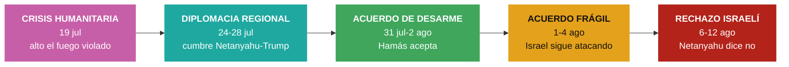

# Cuadro de tendencias — Gaza y Oriente Medio

> [!info] Basado en **11 nodos de impacto** con foco en el Levante (Israel-Hamás, Gaza, diplomacia regional), verificados por Global Pulse entre el **19 de julio** y el **12 de agosto de 2026**. Hilo **entrelazado** con el conflicto Irán–EE.UU. pero con dinámica propia: crisis humanitaria → arquitectura diplomática → acuerdo de desarme → **rechazo israelí**.

> **Actualizado el 12 de agosto**: la ventana anterior cerraba el 4 de agosto con «acuerdo sobre el papel, guerra sobre el terreno». Los ocho días añadidos resuelven la ambigüedad, y no en la dirección esperada: el acuerdo no se cayó por Hamás.

## 1. Arco del periodo (5 fases)



## 2. Tabla cronológica de hitos

| Fecha | Impacto | K | Hito clave |
|---|---|---|---|
| 19 jul | 95 | K1 | Israel mantendrá tropas en **"zonas de seguridad"** en Líbano, Siria y Gaza |
| 19 jul | 82 | K0 | **Epidemia de varicela** en Gaza: 9.300 casos en 2 semanas entre 1,7 M de desplazados |
| 19 jul | 78 | K1 | Crisis humanitaria pese al alto el fuego; ataque israelí a un funeral deja 7 muertos |
| 24 jul | 95 | K1 | Trump condiciona la cooperación nuclear con **Arabia Saudita** a los **Acuerdos de Abraham** |
| 28 jul | 95 | K2 | Cumbre **Netanyahu-Trump**: la **Fuerza Internacional en Gaza** en el centro de la agenda |
| 28 jul | 69 | K1 | **Francia** asume "papel líder" como mediador; ayuda humanitaria vía Egipto |
| 31 jul | 78 | K1 | Trump anuncia acuerdo para el **desarme total de Hamás** ("Junta de Paz", negociado en El Cairo) |
| 1 ago | 95 | K1 | Israel **ataca la mezquita Al Muttaquin** en Gaza mientras Hamás llega a Egipto |
| 2 ago | 95 | K1 | Israel guarda **silencio** sobre el acuerdo anunciado por Trump y aprobado por Hamás |
| 3 ago | 77 | K1 | Arabia Saudita anuncia **coalición de ~14 países** para asegurar el **Mar Rojo** (Bab al Mandeb) |
| 4 ago | 78 | K2 | Israel **intensifica ataques** en Gaza pese al desarme; crecen tensiones con la "Junta de Paz" |
| 5 ago | 61 | K0 | **Funeral masivo** en Gaza: 112 cuerpos recuperados de los escombros dos años después, 40 de ellos niños |
| 6 ago | 78 | K1 | **Netanyahu rechaza el plan de EE.UU.**: el ejército no se retirará hasta el desarme completo; Israel construye **barreras internas** en Gaza |
| 11 ago | 95 | K1 | Netanyahu formaliza el **rechazo** a la hoja de ruta estadounidense y se distancia de Trump, **con las legislativas de octubre en el horizonte** |
| 12 ago | 94 | K1 | **UNICEF: 300 niños muertos en los 300 días** desde el anuncio del alto el fuego |

## 3. Indicadores y ejes de tendencia

| Eje | Estado inicial (19 jul) | Evolución | Estado al 4 ago |
|---|---|---|---|
| Situación humanitaria | Epidemia + 1,7 M desplazados; alto el fuego violado | ▬ persistente | Ataques matan a decenas pese al "acuerdo" |
| Vía diplomática | Sin marco | ▲ cumbre + Junta de Paz + Fuerza Internacional | Acuerdo anunciado, **no consolidado** |
| Postura de Israel | Tropas en zonas de seguridad (Líbano/Siria/Gaza) | ▬ inflexible | Sigue bombardeando; choca con Trump |
| Actores mediadores | — | ▲ EE.UU., Egipto, Francia, Arabia Saudita | Arquitectura multi-actor |
| Dimensión marítima | — | ▲ amenaza hutí en el Mar Rojo | Coalición saudí de 14 países |
| Coste infantil | — | ▬ sostenido bajo el alto el fuego | **300 niños en 300 días** (UNICEF, 12 ago) |
| Quién bloquea | ambigüedad | ▲ se despeja | **Israel, en solitario**: Hamás aceptó, EE.UU. propuso |

## 4. Sub-tendencias detectadas

- **La brecha "acuerdo anunciado" vs. "realidad sobre el terreno":** Trump proclama el desarme de Hamás (vía Truth Social), pero **Israel mantiene silencio, ataca una mezquita e intensifica los bombardeos** en los días siguientes. La tendencia clave del cierre es el **desajuste entre la diplomacia declarada y los hechos**.
- **Arquitectura diplomática en construcción:** aparecen piezas nuevas — la **"Junta de Paz"** de Trump, una **Fuerza Internacional en Gaza**, la extensión de los **Acuerdos de Abraham** a Arabia Saudita y la mediación de **Egipto y Francia**. El andamiaje existe; falta que Israel lo suscriba.
- **Fricción Trump-Netanyahu:** de aliados a tensión abierta — "la paciencia de Trump con Netanyahu se agota"; Israel desafía a la propia Junta de Paz de Washington. Eje relacional a vigilar.
- **Regionalización marítima:** el conflicto se proyecta al **Mar Rojo / Bab al Mandeb** con la amenaza hutí, provocando una coalición naval saudí — el mismo patrón de expansión visto en el frente iraní.
- **Crisis humanitaria estructural:** epidemias (varicela), 1,7 M de desplazados en 1.600 campamentos insalubres y ataques a civiles persisten **por debajo** del ruido diplomático de alto nivel.
- **NUEVO · El bloqueo no vino del enemigo, vino del aliado.** Es el hallazgo central de esta ventana y conviene decirlo sin rodeos: **Hamás aceptó** desarmarse, **EE.UU. propuso** el marco, **Egipto y Francia** mediaron — y quien rechazó fue **Israel**, primero con silencio (2 ago), luego con hechos (6 ago) y por fin de forma explícita (11 ago). La pregunta de julio era si Hamás cumpliría; la respuesta de agosto es que nunca llegó a ponerse a prueba.
- **NUEVO · El calendario electoral israelí como variable geopolítica.** El nodo del 11 de agosto lo dice literalmente: Netanyahu se distancia de Trump «intentando complacer a su base electoral antes de las delicadas elecciones legislativas de octubre». La política interna israelí es hoy el principal obstáculo del proceso, lo que convierte **octubre** en la fecha que ordena todo lo demás.
- **NUEVO · «Alto el fuego» como categoría vacía.** El dato de UNICEF —**300 niños muertos en los 300 días** transcurridos desde que se anunció el alto el fuego— mide exactamente la distancia entre el anuncio y el terreno. Un alto el fuego que no detiene las muertes no es un estado del conflicto: es una etiqueta.
- **NUEVO · Barreras internas: la partición como hecho consumado.** Junto al rechazo del plan, Israel **construye barreras dentro de Gaza** (6 ago). Mientras la diplomacia discute la retirada, sobre el terreno se levanta infraestructura de permanencia. Es el indicador más silencioso y el más difícil de revertir.

## 5. Estado al 12 de agosto

> [!warning] **El acuerdo está muerto y quien lo mató es el aliado.** Netanyahu ha rechazado formalmente la hoja de ruta estadounidense que Hamás había aceptado, se ha distanciado de Trump y ha condicionado cualquier retirada al desarme completo. Mientras tanto Israel bombardea y **levanta barreras internas** en Gaza. La arquitectura diplomática de julio —Junta de Paz, Fuerza Internacional, mediación de Egipto y Francia— sigue en pie sobre el papel y sin nada que sostener.
>
> **Los tres indicadores a vigilar:** (1) las **legislativas israelíes de octubre**, que hoy explican más que cualquier movimiento diplomático; (2) si Trump asume el rechazo o presiona, porque su Junta de Paz ha sido desairada en público; (3) las **barreras internas**, que miden la intención real de permanencia mejor que cualquier declaración.

> [!note] Lo que cambió respecto al cierre del 4 de agosto
> Aquel cuadro hablaba de un acuerdo «no consolidado» y dejaba abierto quién fallaría. Ya no está abierto: **Hamás aceptó y Israel rechazó**. El eje del análisis se desplaza en consecuencia — de «¿se cumplirá el desarme?» a «¿qué hace Washington cuando su aliado tumba su propio plan en año electoral?».

> [!note] Entrelazamiento
> Este hilo es inseparable del de Irán–EE.UU.: la postura regional de Israel, las cumbres en Washington y la amenaza hutí conectan ambos. Ver [[Tendencias — Conflicto Iran vs EEUU]].

## 6. Últimos nodos relacionados — actualización automática

> [!tip] Esta tabla se **rellena sola** con los nodos más recientes del tema cada vez que Obsidian sincroniza (requiere el plugin **Dataview**). El análisis de arriba es una foto fija con fecha; esta lista es la **señal viva** de material nuevo. Filtra por palabra clave en el nombre del nodo, así que puede incluir algún ítem tangencial.

```dataview
TABLE fecha AS "Fecha", impacto AS "Impacto", categoria AS "Categoría", kardashev AS "K"
FROM "10 · Nodos"
WHERE contains(lower(file.name), "gaza") OR contains(lower(file.name), "hamas") OR contains(lower(file.name), "israel") OR contains(lower(file.name), "netanyahu") OR contains(lower(file.name), "mar-rojo")
SORT fecha DESC, impacto DESC
LIMIT 25
```

---
### Nodos fuente (Capa 3)
Ver `10 · Nodos/Geopolitica/` — notas del 2026-07-19 al 2026-08-12 sobre Gaza/Israel/Levante. Fuentes: El País, BBC, DW, France 24, RFI, Al Jazeera, Noticias ONU, The Guardian, entre otras.

[[Global Brain — Inicio|← Inicio]] · [[Tendencias — Conflicto Iran vs EEUU]] · [[Tendencias — Conflicto Rusia vs Ucrania]] · [[Tendencias — Gobernanza y riesgo de la IA]]
